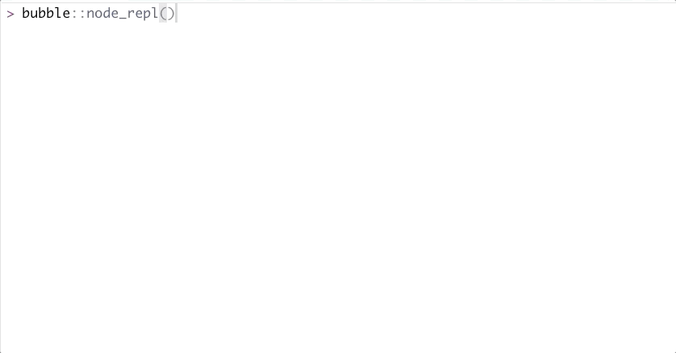

<!-- README.md is generated from README.Rmd. Please edit that file -->

DISCLAIMER: THIS IS A WORK IN PROGRESS, DO NOT USE UNLESS FOR TESTING /
TOYING WITH THE PACKAGE.

# bubble

<!-- badges: start -->

<!-- badges: end -->

The goal of `{bubble}` is to launch and interact with a NodeJS session,
from R.

## Installation

You can install the dev version of `{bubble}` with:

``` r
remotes::install_github("colinfay/bubble")
```

## Example

> Note that you’ll need to have NodeJS installed on your machine

### Using bubble to launch and communicate with a NodeJS session

Launch a new NodeJS session with `NodeSession$new()`.

This function uses the path to your NodeJS binary. On MacOS, it can be
found with `Sys.which("node")`, on Debian `Sys.which("nodejs")` (if
installed through `apt-get install nodejs`).

`NodeSession$new()` tries to guess where NodeJS is by looking at both
these `Sys`. If they are both empty, you’ll get an error, and need to
provide the path manually.

This function returns an object that can be used to interact with the
launched Node session.

``` r
library(bubble)

n <- NodeSession$new() # On my laptop, found with `Sys.which("node")`
n$eval("var x = 12")
#> undefined
n$eval("var y = 17")
#> undefined
n$eval("x + ")
n$eval("y")
#> 29
# Return the x and y values
x <- n$get(x, y)
class(x)
#> [1] "integer"
sum(x)
#> [1] 29
n$state()
#> [1] "running"
n$kill()
#> [1] TRUE
n$state()
#> [1] "terminated"
```

### Using {bubble} to launch an express app

``` r
n <- NodeSession$new( bin = "/usr/local/bin/node")

n$eval("const express = require('express');")
#> undefined
n$eval("app = express()", print = FALSE)

n$eval("app.get('/', function (req, res) {")
n$eval("  res.send('Hello R!')")
n$eval("})", print = FALSE)
n$eval("app.listen(3000)", print = FALSE)

x <- httr::GET("http://127.0.0.1:3000") 
httr::content(x)
#> {html_document}
#> <html>
#> [1] <body><p>Hello R!</p></body>
n$kill()
#> [1] TRUE
```

### Using {bubble} to launch a NodeJS terminal

``` r
node_repl()
```



> This REPL has been inspired by the one from `{reticulate}` :
> <https://rstudio.github.io/reticulate/>

### Using {bubble} to launch a NodeJS script

``` r
n <- NodeSession$new( 
  bin = "/usr/local/bin/node", 
  params = system.file(
    "launch.js", 
    package = "bubble"
  )
)
x <- httr::GET("http://127.0.0.1:3000") 
httr::content(x)
#> {html_document}
#> <html>
#> [1] <body><p>Hello R!</p></body>
n$terminate()
#> [1] TRUE
```

## CoC

Please note that the ‘bubble’ project is released with a [Contributor
Code of Conduct](CODE_OF_CONDUCT.md). By contributing to this project,
you agree to abide by its terms.
